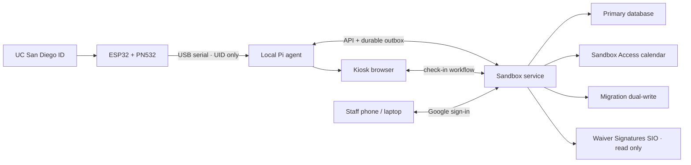

# Scripps Sandbox Check-in System

**Production specification 0.1 · Technical-spike baseline · 2026-08-10**

## 1. Purpose

Build a dependable, Scripps-only check-in and presence system for the Sandbox Makerspace. The public kiosk records arrival; the staff application shows who is present, supports staff-managed departures, and lets appropriately authorized trainers record tool certifications.

The system must keep operating through ordinary network and reader failures, migrate without interrupting the current process, and preserve the existing Waiver Signatures sheet as a read-only source.

## 2. Scope and boundaries

### In scope

- Raspberry Pi kiosk on a 1920×1080 touchscreen with keyboard and mouse.
- ESP32/PN532 card reader connected to the Pi by USB serial.
- Card and manual UCSD ID check-in.
- Missing-profile, unknown-card, waiver, error, and closing-soon flows.
- Staff-authored arrival announcements, editable locally and remotely.
- Presence roster and staff checkout from phone or laptop.
- User search and per-tool certification by authorized trainers.
- Operating state derived from the Sandbox Access Google Calendar.
- Migration from User Database SIO and Activity Log SIO without downtime.
- Read-only waiver lookup from Waiver Signatures SIO.

### Not in the first production release

- Equipment enablement or machine interlocks.
- Self-checkout on the public kiosk.
- Multiple makerspaces or sites.
- Expiring certifications or trainer authorizations (the schema will support later addition).
- Offline creation of training grants.

## 3. Roles and permissions

| Role | Presence and checkout | Messages | User lookup | Grant tool certification | Manage trainers / revoke / correct |
|---|---:|---:|---:|---:|---:|
| Staff | Yes | Yes | Limited | No | No |
| Trainer | Yes | Yes | Yes | Only for authorized tools | No |
| Administrator | Yes | Yes | Yes | Yes | Yes |

Staff authenticate with UC San Diego Google Workspace accounts. Access requires both a successful Google sign-in and an active entry in the staff allowlist. Every write is authorized again by the backend; hidden interface controls are not a security boundary.

Trainer authorization is per tool. Being certified to use a tool and being allowed to train others on it are separate records.

## 4. System shape

The ESP32 remains deliberately simple: read the card, display reader feedback, and print an uppercase UID over serial at 115200 baud. It contains no Google credentials, person records, waiver data, or authorization logic.

The local Pi agent owns reader reconnection, de-duplication, local health, an encrypted cache of the minimum data needed for offline check-in, and a durable event outbox. The browser never needs direct serial-device access.

## 5. Core workflows

### Card check-in

1. Reader sends a UID to the local agent.
2. Agent suppresses repeated scans of the same card inside two seconds and emits a local browser event.
3. Kiosk resolves the credential through the service, or through its last-known eligible-user cache when offline.
4. The service creates one idempotent visit event and returns the appropriate result: complete, missing information, unknown card, missing/revoked waiver, or unavailable.
5. Kiosk shows the result and any staff or closing-soon notice, then returns home automatically.

The technical spike currently completes steps 1–2 and feeds the existing prototype flow. Identity lookup and visit creation are the next vertical slice.

### Manual UCSD ID check-in

“UCSD ID” is the user-facing and canonical field; it may contain a student PID or an employee ID. A successful match can connect a newly presented card only after the user confirms the relationship. Full IDs and card UIDs are never displayed in public confirmation screens.

### Presence and departure

A successful check-in opens a visit. The staff dashboard lists open visits and current headcount. Staff mark someone as having left from a phone or laptop; the public kiosk does not expose checkout. Staff can reopen a mistaken checkout, with an audit record. Closing staff receive an explicit end-of-day review of all remaining open visits.

### Tool certification

An authorized trainer searches for a user, selects one of the tools for which that trainer holds active authorization, confirms the grant, and records it. The backend rejects grants outside that authorization. Grant, revoke, and correction events record actor, subject, tool, timestamp, source, and reason or note.

Certification and trainer-authorization records have nullable `expires_at` fields. They do not expire unless a future policy sets that value.

### Announcements and closing alerts

Staff messages have a short heading, concise body, active interval, priority, author, and audit history. They can be edited at the kiosk or remotely. The kiosk gives an active message the scale of a temporary poster without permanently crowding the default screen.

When public access closes within 30 minutes, the kiosk shows a closing-soon notice on the arrival screen and after successful check-in. The notice includes the remaining time and safe-stop guidance.

## 6. Calendar interpretation

`Sandbox Access` is authoritative for public operating state:

- No event covering the current time: **closed**.
- An event title explicitly indicating open access, such as `Open` or `Door Open – Independent Access`: **open to eligible users**.
- A workshop, reservation, or named event without an open-access marker: **event-only; closed to general use**.
- A closing or restricted marker, such as `Makerspace Closed`: **closed**, and it overrides an overlapping open event.
- Restricted/event-only events override open events when they overlap unless an administrator has explicitly classified the event.

The service stores a short-lived normalized calendar snapshot so the Pi can use the last known operating state during an outage. Stale state must be visibly identified to staff. Event-title classification rules live in configuration and have test fixtures; they are not scattered through the kiosk interface.

## 7. Data model

The primary database uses normalized records:

- `people`: canonical person profile and lifecycle state.
- `identifiers`: UCSD ID, email, and other identity keys with uniqueness and verification metadata.
- `credentials`: hashed or encrypted card credential mapping; raw values are not application logs.
- `visits`: check-in/out timestamps, method, authorizing entity, flags, notes, sync state, and idempotency key.
- `waiver_status`: matched waiver snapshot, source row identifier, signed date, and nullable `revoked_at`.
- `tools`: stable tool catalog and active state.
- `tool_certifications`: person, tool, grantor, granted date, nullable `expires_at`, revocation, and source.
- `trainer_authorizations`: staff member, tool, grantor, nullable `expires_at`, revocation, and source.
- `staff_accounts` and `staff_roles`: Google identity, active allowlist state, and role assignment.
- `announcements`: content, schedule, priority, author, and publication state.
- `calendar_snapshots`: normalized access intervals, classification, source event ID, and fetched time.
- `devices`: kiosk/reader identity, version, last seen, and health.
- `audit_events`: immutable actor/action/subject record for privileged or corrective actions.
- `outbox_events`: durable, idempotent offline writes awaiting synchronization.

An open visit has no checkout timestamp. The service prevents duplicate open visits for one person while safely returning the existing visit for repeated idempotent requests.

## 8. Existing Google data

- **User Database SIO** supplies current profiles, card mappings, existing wide-format training flags, and the staff allowlist.
- **Activity Log SIO** is the current visit/activity record.
- **Waiver Signatures SIO** remains read-only because its DocuSign connection is externally owned. Waiver matching uses the canonical UCSD ID. Waivers do not expire; they may be explicitly revoked in the new system.

Migration imports users and training flags into normalized records, retaining source identifiers and import timestamps. During a measured transition, new visits and training changes write to the primary database and mirror to the existing sheets. Reconciliation reports compare both stores. Cutover occurs only after backfill, dual-write, reconciliation, and rollback tests succeed. The waiver sheet is never replaced or written by this project.

## 9. Failure behavior

| Failure | Public kiosk behavior | Staff behavior | Recovery |
|---|---|---|---|
| Network/backend unavailable | Known eligible users may check in provisionally from encrypted last-known data; unknown/new users are directed to staff | Shows offline/stale status and queued event count | Durable outbox retries with idempotency keys |
| Reader unavailable | Clear reader-unavailable notice; manual UCSD ID remains available | Device health shows reader fault | Agent reconnects serial automatically |
| Google identity unavailable | Existing signed-in kiosk remains usable where possible; no new privileged session | No new staff writes without verified identity | Resume after sign-in service returns |
| Calendar unavailable | Use last-known snapshot and mark it stale for staff | Staff may publish an explicit temporary notice; access override requires admin audit | Refresh and reconcile when service returns |
| Waiver source unavailable | Use a recent verified snapshot only within the approved freshness window; uncertain/new users go to staff | Waiver uncertainty is visible | Refresh snapshot and resolve provisional records |
| Pi restarts | Kiosk and bridge start automatically | Open visits remain server-side | Local outbox and cache survive restart |

Offline check-in is provisional, never silent: the user sees a normal completion message, while staff can see that synchronization is pending. Training grants, trainer changes, waiver revocations, and other privileged mutations require a live backend.

## 10. Security, privacy, and retention

- Bind the scanner bridge to loopback only. Do not expose it directly to the campus network.
- Encrypt local cache and outbox storage; store only fields required for offline eligibility and display.
- Use TLS for remote API traffic and protected secret storage on the Pi.
- Do not log full card UIDs, UCSD IDs, waiver records, or profile payloads.
- Rate-limit manual lookup and reader events. Protect every write with authorization, CSRF/session controls, validation, and idempotency.
- Record an audit event for role changes, trainer authorization, certification grants/revocations/corrections, waiver revocation, checkout corrections, and access overrides.
- Keep access to identifiable presence data to staff with an operational need.

Identifiable visit retention is configurable. The provisional planning value is eight years, but no automatic purge will be activated until the applicable UCSD records and privacy category is confirmed. Aggregated, de-identified statistics may be retained indefinitely. This policy decision must be recorded before production launch.

## 11. Pi deployment and observability

The Pi runs the browser in kiosk mode plus separate managed services for the local agent and web application. Services start on boot, restart after failure, and expose local health. Device health includes reader connection, backend reachability, calendar snapshot age, outbox depth, application version, and last successful sync.

The initial scanner bridge is under `bridge/`. It validates hexadecimal UID-only lines, ignores firmware diagnostics, suppresses duplicate reads, reconnects automatically, and emits browser events over a loopback WebSocket. The hosted prototype has no local bridge endpoint and therefore remains in demo mode.

## 12. Acceptance criteria by milestone

### Milestone A — reader vertical slice

- A physical card tap reaches the locally served kiosk without browser refresh.
- Duplicate reads are suppressed and the full UID is absent from logs and public UI.
- Disconnecting and reconnecting the ESP32 does not require restarting the kiosk.
- Manual check-in remains available when the reader is down.

### Milestone B — durable check-in

- Known card and UCSD ID create exactly one visit online.
- Known eligible users can check in during a network outage and the event synchronizes later exactly once.
- Unknown cards, incomplete profiles, and waiver uncertainty follow distinct tested flows.
- Current presence matches all open visits.

### Milestone C — staff operations

- Allowlisted staff can view headcount and mark departures from phone/laptop.
- Trainers can grant only their authorized tools; administrators can manage authorizations.
- Every privileged change is auditable.
- Remote and kiosk-authored announcements appear within a defined refresh interval.

### Milestone D — migration and launch

- Source data is backfilled and reconciled without exposing personal data in reports.
- Dual-write runs successfully for the agreed observation period.
- Calendar classification fixtures cover open, closed, event-only, and overlap cases.
- Backup, restore, offline, reader-failure, and rollback drills pass.
- Retention and waiver-snapshot freshness policies are approved and configured.

## 13. Immediate next slice

Run the bridge on the Raspberry Pi against the existing ESP32, serve the kiosk locally, and validate real scans. Then replace the prototype’s simulated recognized-card completion with a small backend contract:

- `POST /check-ins/card` with a device-scoped credential token and idempotency key.
- `POST /check-ins/manual` with UCSD ID and idempotency key.
- `GET /kiosk-state` for operating state, closing time, announcements, and data freshness.
- `GET /device-health` locally for service diagnostics.

The responses should contain display-safe states and names only when needed; the kiosk should not receive broad person, waiver, or training datasets during normal online operation.
